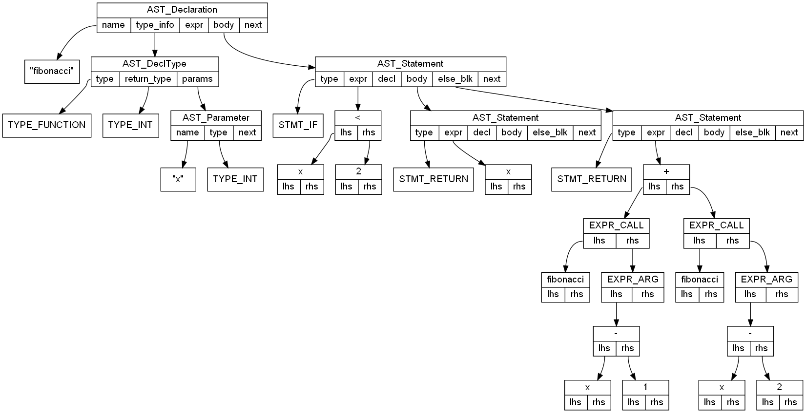

# Lexer and Parser
## Sample Source Input
```
func fibonacci(x: int) -> int {
    if x < 2 {
        return x;   // This is a comment
    } else {
        return fibonacci(x-1) + fibonacci(x-2);
    }
}
```
## Syntax Tree Generated For Graphviz
<p align="center"></p>
