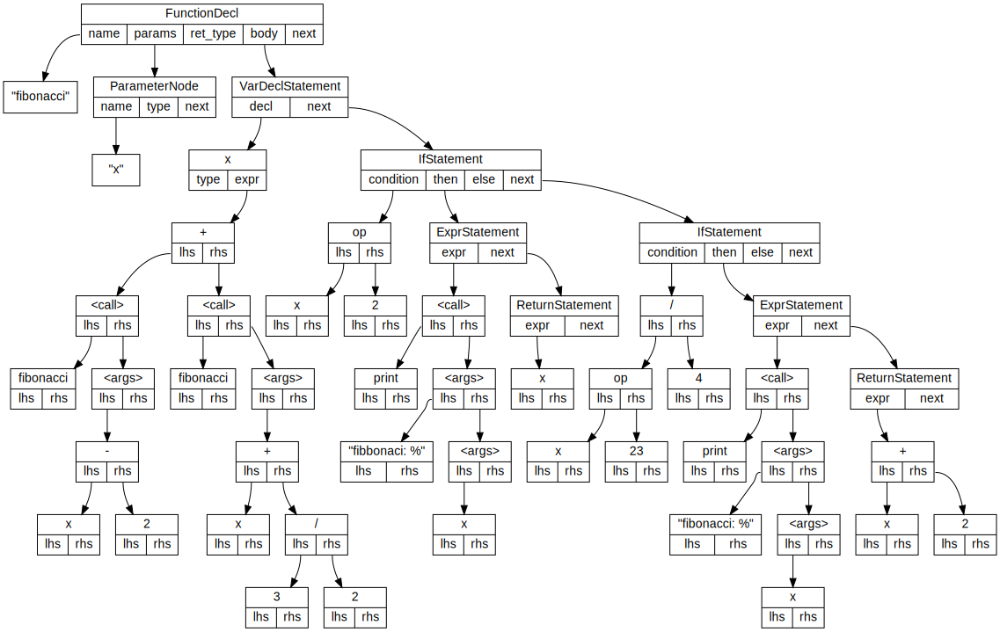
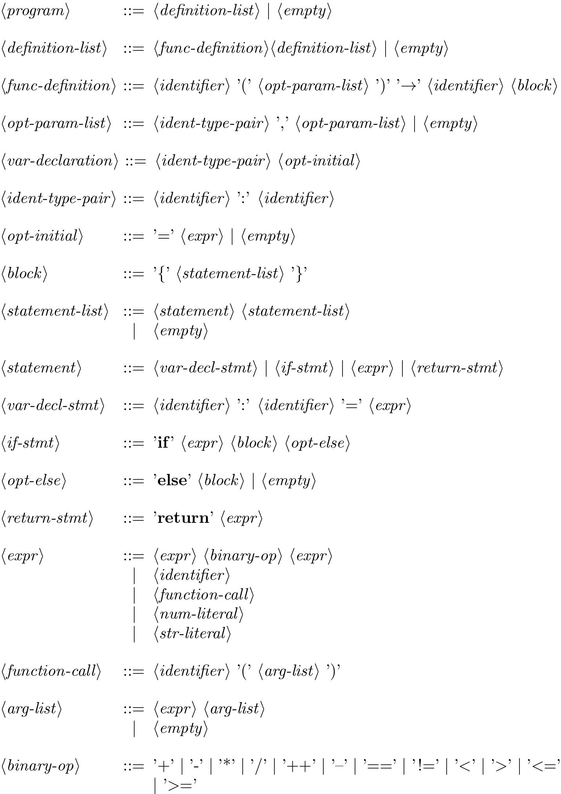

# Lexer and Parser
## Sample Source Input
```
// This is a comment
fibonacci(x: int) -> int {
    x : int = 0;

    if x < 2 {
        x = 1;   // This is another comment
    } else {
        x = fibonacci(x-1) + fibonacci(x-2);
    }

    return x;
}
```
## Abstract Syntax Tree Visualized Using Graphviz
<p align="center"></p>

## Backus-Naur Form Description of the Grammar
<p align="center"></p>